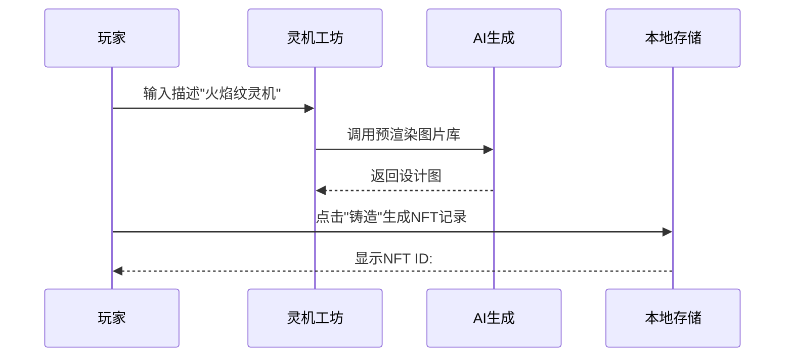

以下是《灵元界：暗灵之战》的**运行方法与游玩控件详解**，专为GitHub Pages部署优化设计：

---

### **一、运行方法**
#### **1. 在线游玩（推荐）**
- **步骤**：  
  1. 访问GitHub Pages生成的URL（格式：`https://NaturalRice.github.io/Arts-Tech-From-AI-to-NFTs/`）。  
  2. 首次加载需等待资源初始化（约5-10秒）。  
  3. 点击**「开始游戏」**按钮进入主界面。  

#### **2. 本地运行（开发测试）**
```bash
# 克隆仓库
git clone https://github.com/[用户名]/[仓库名].git
cd [仓库名]

# 启动本地服务器（任选其一）
python -m http.server 8000  # Python3
npx live-server             # 需Node.js环境
```
- 访问 `http://localhost:8000` 或 `http://127.0.0.1:8000`。

---

### **二、核心游玩控件**
#### **1. 基础操作**
| **按键/操作**       | **功能**                             | **适用场景**               |
|---------------------|-------------------------------------|--------------------------|
| **方向键（↑↓←→）**  | 控制角色移动                          | 探索地图、躲避敌人           |
| **空格键**          | 交互/确认                           | 与NPC对话、拾取物品          |
| **Q键**             | 打开任务日志                         | 查看当前任务与奖励           |
| **I键**             | 打开NFT库存                         | 查看/交易灵机设计图          |
| **ESC键**           | 暂停游戏/关闭当前窗口                 | 中断战斗或退出菜单           |

#### **2. 界面交互**
| **UI元素**          | **操作方式**                        | **功能说明**               |
|---------------------|-------------------------------------|--------------------------|
| **任务大厅**        | 鼠标点击任务卡片                     | 接受任务或查看详情           |
| **灵机工坊**        | 输入文本后点击「生成」按钮             | 创建自定义灵机NFT           |
| **门派市场**        | 拖拽NFT到交易栏 + 设置价格            | 上架或购买灵机设计           |
| **对话选项**        | 鼠标点击或数字键（1/2/3）选择          | 影响剧情分支（需预加载AI生成内容）|

#### **3. 快捷键扩展（开发者模式）**
在浏览器控制台输入以下代码解锁调试功能：
```javascript
// 开启调试模式
window.debugMode = true;
// 添加1000灵力
player.spiritualPower += 1000;
```
> 警告：此操作会跳过游戏平衡性设计！

---

### **三、关键功能演示**
#### **1. NFT铸造流程**


#### **2. 任务接取逻辑**
1. 按**Q键**打开任务日志。  
2. 选择`"探寻遗迹"`任务，查看目标：  
   - ✔️ 找到废墟（地图标记）  
   - ✔️ 击败守卫（战斗触发）  
   - ✔️ 获取灵机图纸（奖励NFT）  

---

### **四、常见问题处理**
| **问题**                | **解决方法**                              |
|-------------------------|-----------------------------------------|
| 角色无法移动            | 检查键盘锁定状态，或刷新页面重载控制脚本。       |
| NFT不显示               | 清除浏览器缓存后重新登录（`localStorage`重置）。|
| 任务卡死                | 在控制台输入 `resetQuest("quest_1")` 重置任务。 |

---

### **五、翻译对照表（中英文控件）**
| **英文控件**       | **中文翻译**          | **技术影响**               |
|--------------------|----------------------|--------------------------|
| `Quest Log`        | 任务日志              | 无（JSON键名仍用`questLog`） |
| `Mint NFT`         | 铸造NFT               | 无（函数名仍用`mintNFT`）    |
| `Spiritual Power`  | 灵力值                | 需同步修改`game_content.json`|

---

**注意事项**：  
1. 所有操作说明需在`README.md`中明确标注，避免玩家困惑。  
2. 控件翻译需保证代码中的变量名不变（如`player.spiritualPower`）。  

按此设计，玩家可快速上手，开发者也能维护代码稳定性。如需进一步优化控件交互逻辑，可扩展`script.js`中的事件监听器。
