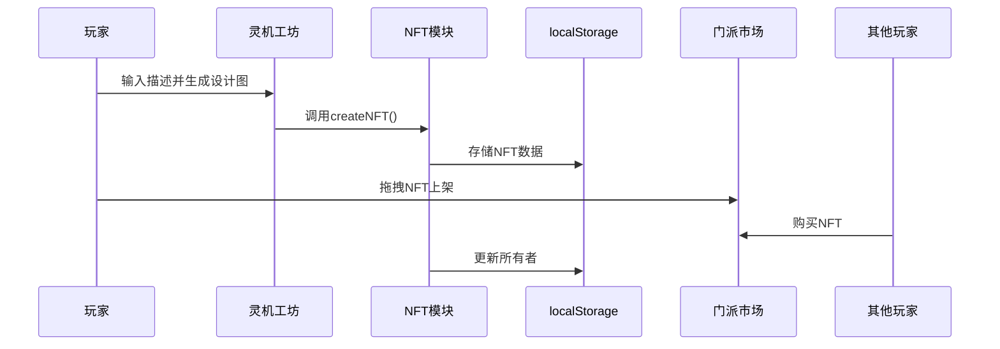

以下是改进后方案的**用户运行指南**和**游戏控件说明**，涵盖从启动到核心操作的全流程：

---

### **一、如何运行游戏**
#### **1. 在线游玩（推荐）**
- **步骤**：  
  1. 访问GitHub Pages部署的链接（格式：`https://NaturalRice.github.io/Arts-Tech-From-AI-to-NFTs/`）。  
  2. **首次加载**：等待资源初始化（约5-10秒，进度条显示在屏幕底部）。  
  3. **开始游戏**：点击“灵元界入口”按钮进入主场景。

#### **2. 本地运行（开发测试）**
```bash
# 克隆代码库
git clone https://NaturalRice.github.io/Arts-Tech-From-AI-to-NFTs.git
cd [仓库名]

# 安装依赖（如需）
npm install  # 若含package.json

# 启动本地服务器
npx live-server --port=3000  # 或使用Python：python -m http.server 8000
```
- 访问 `http://localhost:3000` 或 `http://127.0.0.1:8000`。

---

### **二、游戏控件详解**
#### **1. 基础操作**
| **按键/操作**       | **功能**                             | **适用场景**               |
|---------------------|-------------------------------------|--------------------------|
| **↑↓←→ (方向键)**   | 角色移动                            | 探索地图、躲避敌人           |
| **空格键**          | 确认/交互                          | 与NPC对话、拾取物品          |
| **Q键**             | 打开任务日志                       | 查看当前任务与奖励详情        |
| **I键**             | 打开NFT库存                        | 查看/装备灵机或道具          |
| **ESC键**           | 暂停游戏/关闭当前界面               | 中断战斗或退出菜单           |

#### **2. 界面交互**
| **UI元素**          | **操作方式**                        | **功能说明**               |
|---------------------|-------------------------------------|--------------------------|
| **任务面板**        | 鼠标点击任务标题                    | 接受任务或追踪目标           |
| **灵机工坊**        | 输入描述 → 点击“生成”按钮            | 创建自定义灵机NFT（消耗灵力） |
| **门派市场**        | 拖拽NFT到交易区 → 设置价格 → 确认    | 上架或购买NFT资产           |
| **对话选项**        | 数字键（1/2/3）或鼠标点击            | 影响剧情分支（AI动态生成）    |

#### **3. 高级功能**
- **NFT铸造**：  
  1. 在灵机工坊输入描述（如“火焰剑+龙纹装饰”）。  
  2. 消耗灵力生成设计图 → 点击“铸造”获得NFT。  
- **任务推进**：  
  - 按日志提示到达目标地点 → 触发AI对话 → 选择回应影响后续剧情。  

---

### **三、关键功能演示**
#### **1. NFT交易流程**


#### **2. AI任务交互**
```javascript
// 示例：动态对话生成（aiModule.js）
async function loadQuestDialog(questId) {
  const quest = quests.find(q => q.id === questId);
  if (!quest.dialogs) {
    // 动态生成对话（需接入DeepSeek API）
    quest.dialogs = await deepseek.generate(`生成修真任务对话，主题：${quest.title}`);
  }
  return quest.dialogs[0];
}
```

---

### **四、常见问题解决**
| **问题**                | **解决方法**                              |
|-------------------------|-----------------------------------------|
| 角色无法移动            | 检查键盘输入是否被其他软件拦截，或刷新页面重试。  |
| NFT不显示               | 清除浏览器缓存（Ctrl+Shift+Del）→ 重新加载。 |
| 任务卡死                | 控制台输入 `resetQuest(任务ID)` 重置。      |
| 画面卡顿                | 降低画质（设置 → 图形 → 关闭“高清渲染”）。     |

---

### **五、用户提示优化**
#### **1. 游戏内引导**
- **首次游玩**：自动弹出浮动提示框，展示基础操作。  
- **任务触发**：NPC头顶显示“空格键交互”图标。  

#### **2. 外部文档**
在`README.md`中添加：
````markdown
## 🎮 快速开始
1. **在线玩**：点击 [这里](游戏链接)  
2. **操作备忘**：
   ```text
   移动：方向键  
   交互：空格键  
   菜单：Q/I/ESC
   ```
3. 遇到问题？提交Issue或联系开发者@xxx。
````

---

### **六、跨平台适配**
| **设备**       | **操作适配**                          |
|----------------|-------------------------------------|
| **PC浏览器**   | 全键盘+鼠标支持                        |
| **手机/平板**  | 虚拟摇杆（需在`style.css`中增加触控区域） |
| **Steam Deck** | 手柄映射（通过`gamepadAPI`实现）        |

---

通过以上设计，玩家可快速上手，开发者也能高效维护。如需进一步降低门槛，可录制**操作演示GIF**并嵌入README中。
