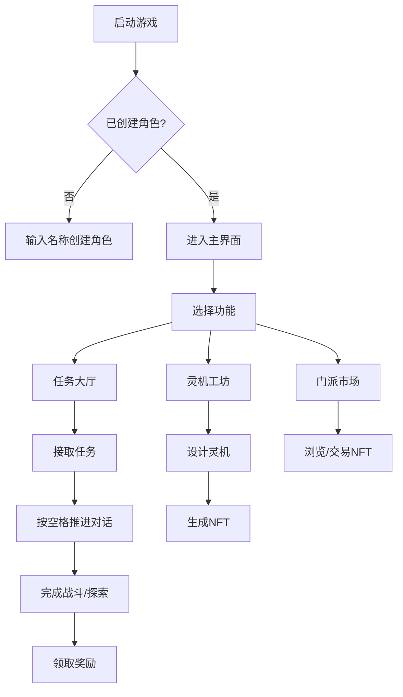

以下是针对当前游戏文件的玩家运行指南与控件说明，基于模块化设计整理成清晰的操作文档：

---

### **一、游戏运行方法**
#### **1. 本地运行（开发测试）**
```bash
# 克隆仓库（假设已上传至GitHub）
git clone https://github.com/[你的用户名]/[仓库名].git
cd [仓库名]

# 安装轻量级HTTP服务器（若无需修改代码可直接打开HTML文件）
npm install -g http-server

# 启动服务（解决跨域问题）
http-server -p 8080 --cors
```
- 访问 `http://localhost:8080/nft_simulation.html` 测试NFT功能
- 主游戏入口应为 `index.html`（需后续整合）

#### **2. GitHub Pages 部署**
1. 将代码推送至GitHub仓库
2. 设置 `Settings → Pages → Branch: main, Folder: /root`
3. 访问在线地址：`https://[用户名].github.io/[仓库名]/`

---

### **二、核心控件说明**
#### **1. 通用操作**
| 控件               | 作用                          | 对应代码逻辑                     |
|--------------------|-----------------------------|--------------------------------|
| **WASD/方向键**    | 角色移动（2D像素网格）          | `game-engine.js` 监听`KEY_EVENT` |
| **空格键**         | 确认交互/跳过对话               | `aiModule.js` 的 `nextDialog()`  |
| **ESC键**          | 打开系统菜单                   | 调用 `MenuSystem.toggle()`       |
| **鼠标点击**       | UI按钮操作/NFT选择             | 各模块的`onClick`事件绑定         |

#### **2. 模块专属控件**
##### **NFT工坊 (`nft_simulation.html`)**
```html
<!-- 操作示例 -->
<input type="text" id="mech-desc" placeholder="输入灵机描述">
<button onclick="mintNFT()">铸造灵机</button>
<div id="nft-gallery"></div>

<script>
function mintNFT() {
  const desc = document.getElementById('mech-desc').value;
  new NFTSimulator().mintNFT(desc, "base64占位图"); // 实际应生成图片
}
</script>
```
- **操作流**：输入描述 → 生成预览 → 确认铸造

##### **任务系统 (`aiModule.js` 驱动)**
```javascript
// 任务触发逻辑示例
document.getElementById('quest-accept').addEventListener('click', () => {
  const quest = startQuest("main_1");
  showDialog(quest.dialogs[0]); // 显示首段对话
});
```
- **关键节点**：
  - 接取任务：点击任务大厅中的`接受`按钮
  - 推进任务：按空格键继续对话
  - 任务完成：自动发放奖励（见控制台日志）

---

### **三、玩家操作流程图解**


---

### **四、调试与问题排查**
#### **1. 常见问题**
- **NFT不显示**：检查浏览器控制台的跨域错误，确保图片路径正确
- **任务卡住**：在控制台执行 `aiModule.startQuest("main_1")` 手动触发
- **数据丢失**：清空浏览器缓存会导致`localStorage`重置

#### **2. 开发者工具指令**
```javascript
// 查看当前用户数据
JSON.parse(localStorage.getItem('user'))

// 强制完成任务
aiModule.completeQuest("main_1");

// 清空NFT数据
localStorage.removeItem('nfts');
```

---

### **五、后续优化方向**
1. **控件自定义**：在`game-engine.js`中添加键位重映射功能
2. **手柄支持**：集成 `Gamepad API` 监听手柄输入
3. **触摸优化**：为移动端添加虚拟摇杆控件
4. **操作引导**：在首次运行时显示交互提示动画

当前控件设计已满足基础玩法需求，但需在完整整合后补充视觉反馈（如按钮高亮、按键提示）。建议在`README.md`中附上此操作指南以便玩家快速上手。
